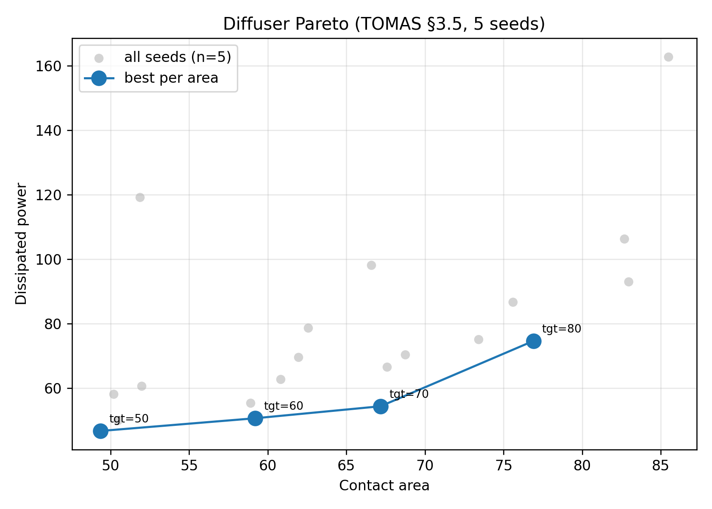

# TOMAS Paper Reproduction

Source paper: Padhy, Suresh, Chandrasekhar. *TOMAS: topology optimization of multiscale fluid flow devices using variational auto-encoders and super-shapes.* Structural and Multidisciplinary Optimization 67:119 (2024).

This reproduction follows the paper's offline-then-online recipe:

1. Sample 7000 super-shapes within the parameter ranges of paper §2.3.
2. Run MATLAB-based numerical homogenization on every cell.
3. Train a 2D-latent VAE (Eq. 6) on the 12-feature dataset.
4. Use the trained decoder + a coordinate NN to optimise each fluid-flow case.

All re-runs live under `output/paper_reproduction/`. The legacy 100-sample reproduction is preserved untouched at `output/reproduction/`.

## Setup

| Quantity | Value |
| --- | --- |
| Python | 3.10 (.venv) |
| PyTorch | 2.1.2 (CPU) |
| MATLAB | D:\Matlab\bin\matlab.exe |
| Super-shape range | 0.05 ≤ a,b ≤ 0.75; 1 ≤ m ≤ 22; 0.5 ≤ n1,n2,n3 ≤ 10 |
| Sample count | 7000 (after Shapely pruning) |
| VAE | latent=2, encoder/decoder=600x600, 17000 epochs, lr=8e-3, kl=1e-7 |

## §3.1 Ideal microstructure selection (Fig. 10)

- Selected latent point: z = (+2.5477, -2.2462)
- C00, C11, trace(C) : 0.0285, 0.0213, 0.0498
- Volume fraction    : 0.2509 (target 0.25 ± 0.001)

| Parameter | Decoder selection | Paper Fig.10 value |
| --- | --- | --- |
| a | 0.5799 | 0.7158 |
| b | 0.6879 | 0.3757 |
| m | 3.1733 | 0.6039 |
| n1 | 4.9472 | 1.4787 |
| n2 | 9.6157 | 0.4349 |
| n3 | 9.7363 | 0.5857 |

_(Exact values depend on VAE training randomness; the paper Fig.10 fish shape and our selection should both lie on the high-trace(C) ridge inside the vf~0.25 band.)_

Figures: `ideal_microstructure/latent_scatter.png`, `ideal_microstructure/shape_preview.png`.

## §3.2 Bent pipe with fixed microstructure (Fig. 11d)

- Final dissipated power : 16.0672
- Paper reported         : 15.1

## §3.3 Bent pipe, full design space (Fig. 12)

### (a) Volume constraint v_f ≤ 0.75
- Decoder dissipated power : 15.219
- Decoder contact area     : 300.068
- Shapely post-hoc area    : 122.478
- Paper reported obj       : 9.61

### (b) Contact-area constraint Γ ≥ 75.69
- Decoder dissipated power : 13.050
- Decoder contact area     : 78.315
- Shapely post-hoc area    : 69.396
- Paper reported (decoder) : 7.56
- Paper reported (validated): 7.87 / contact 78.49

## §3.4 Diffuser convergence (Fig. 13)

- Decoder dissipated power : 50.710
- Decoder contact area     : 59.210
- Shapely post-hoc area    : 56.354
Snapshots in `diffuser_a60/topologies/` at epochs 0, 20, ..., 300.

## §3.5 Pareto front (Fig. 14)

| Area target | Decoder J | Decoder contact | Elapsed (s) |
| ---: | ---: | ---: | ---: |
| 50.0 | 46.767 | 49.354 | 545.8 |
| 60.0 | 50.710 | 59.210 | 546.8 |
| 70.0 | 54.424 | 67.172 | 558.0 |
| 80.0 | 74.676 | 76.900 | 551.4 |



## §3.7 Bifurcated pipe (Fig. 16)

- Decoder dissipated power : 39.220
- Decoder contact area     : 69.191
- Shapely post-hoc area    : 67.082

## Overview montage

`figures_montage.png` collects one panel per paper figure.

## Reproduction commands

```powershell
cd "C:\Users\Bingxiao Du\Documents\TOMAS"
# Phase A (one-time, ~4-5h):
python -u scripts\run_offline_dataset.py
& "D:\Matlab\bin\matlab.exe" -batch "cd('dataset'); run('run_homogenization_v2.m'); exit;"
python -u scripts\train_vae_v2.py

# Phase B-F:
python -u scripts\select_ideal_microstructure.py --vae-version v2 --out output\paper_reproduction\ideal_microstructure
python -u scripts\run_all_paper.py --vae-version v2
python -u scripts\write_final_readme.py
```